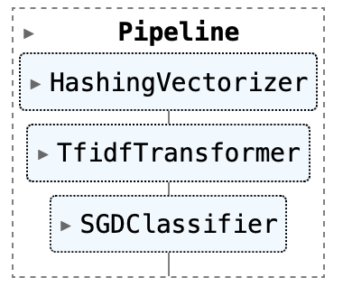

# Scaling Machine Learning Medels Using Dask
This tutorial demonstrates how we can scale a machine learning model in Dask.

Learning outcomes of the tutorial are:
1. Learn how to implement distributed training.
2. Learn how to train for small dataset but predict for a much larger data.
3. Learn how to incrementally train large datasets.
4. Learn how to use Dask high-level collections to train on large datasets.

***

## Distributed Training

Distributed Training is particularly beneficial for training large models with medium-sized datasets. This scenario becomes relevant when dealing with extensive hyperparameter exploration or employing [ensemble method](https://scikit-learn.org/stable/modules/ensemble.html) involving numerous individual estimators.

To illustrate the concept of distributed training, we will utilize the [Newsgroup dataset]((https://scikit-learn.org/stable/modules/generated/sklearn.datasets.fetch_20newsgroups.html)) from Scikit-learn. 

```

from sklearn.datasets import fetch_20newsgroups
data = fetch_20newsgroups(subset='train', categories=categories)

```

Our objective is to construct a machine learning pipeline that performs the following tasks:

1. [Tokenise the Text](https://scikit-learn.org/stable/modules/generated/sklearn.feature_extraction.text.HashingVectorizer.html)
2. [Normalize the data](https://scikit-learn.org/stable/modules/generated/sklearn.feature_extraction.text.TfidfTransformer.html)
3. [Implement an SGDClassifier](https://scikit-learn.org/stable/modules/generated/sklearn.linear_model.SGDClassifier.html)

```

pipeline = Pipeline([
    ('vect', HashingVectorizer()),
    ('tfidf', TfidfTransformer()),
    ('clf', SGDClassifier(max_iter=1000)),
])

```



Each of these pipeline steps can possess distinct hyperparameters that significantly influence the model's accuracy. It is highly advisable to conduct a comprehensive search across a range of parameters within each step to identify the most suitable hyperparameters for the model. This process, known as hyperparameter tuning, is essential for optimizing the model's performance. In this tuturial we will be scoring a very small number of hyperparameters.

```

parameters = {
    'tfidf__use_idf': (True, False),
    'tfidf__norm': ('l1', 'l2'),
    'clf__alpha': (0.00001, 0.000001),
}

```


In this tutorial, we leverage [GridSearchCV](https://scikit-learn.org/stable/modules/generated/sklearn.model_selection.GridSearchCV.html) to identify the most appropriate hyperparameters for the defined pipeline. 

```

grid_search = GridSearchCV(pipeline, parameters, n_jobs=-1, verbose=1, cv=3, refit=False)

```

Assessing hyperparameters with GridSearchCV involves a "fit" operation that demands substantial computational resources. To __fit__ this on a single node, we usually call the function

```

grid_search.fit(data.data, data.target)

```
Scikit-learn uses [joblib](http://joblib.readthedocs.io/) for single-machine parallelism. This lets you train most estimators (anything that accepts an `n_jobs` parameter) using all the cores of your laptop or workstation. Alternatively, Scikit-Learn can use Dask for distributed parallelism.  This lets you train those estimators using all the cores of your *cluster* without significantly changing your code. 

```

import joblib
with joblib.parallel_backend('dask'):
    grid_search.fit(data.data, data.target)

```


***

## Score and Predict Large Datasets

Sometimes you'll train on a smaller dataset that fits in memory, but need to predict or score for a much larger (possibly larger than memory) dataset. In this situation, you can use [ParallelPostFit](http://ml.dask.org/modules/generated/dask_ml.wrappers.ParallelPostFit.html) to parallelize and distribute the scoring or prediction steps. 

We'll generate a random dataset with scikit-learn to train the model.

```

X_train, y_train = make_classification(n_features=2, n_redundant=0, n_informative=2,
    random_state=1, n_clusters_per_class=1, n_samples=1000)

```

__X_train__ and __y_train__ here is small enough to fit a on a single node. We will replicate this dataset multiple times with to create __X_large__ and __y_large__ and this represent the larger than memory dataset.

```

N = 100
X_large = da.concatenate([da.from_array(X_train, chunks=X_train.shape)
                          for _ in range(N)])
y_large = da.concatenate([da.from_array(y_train, chunks=y_train.shape)
                          for _ in range(N)])

```

Since our training dataset fits in memory, we can use a scikit-learn estimator as the actual estimator fit during traning. But we know that we’ll want to predict for a large dataset, so we’ll wrap the scikit-learn estimator with ParallelPostFit

```

from sklearn.linear_model import LogisticRegressionCV
from dask_ml.wrappers import ParallelPostFit

clf = ParallelPostFit(LogisticRegressionCV(cv=3), scoring="r2")

```

Now we can train the model on the small dataset 

```

clf.fit(X_train, y_train)

```

and predict using the large dataset.

```
y_pred = clf.predict(X_large)

```

One this to note here is that __ParallelPostFit__ is the meta-estimator that parallelize post-fit tasks.  It can wrap any scikit-learn estimator to provide parallel predict, predict_proba, and transform methods. It cannot parallelize the training step.
***
## References
1. https://tutorial.dask.org/00_overview.html
2. https://ml.dask.org
3. https://jobqueue.dask.org/en/latest/generated/dask_jobqueue.PBSCluster.html

*** 
## Contributers
1. [Joseph John](https://www.josephjohn.org) 


